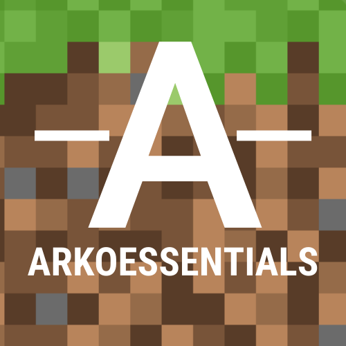

 

  

<h3 align="center">ArkoniusEssentials</h3>

  

    <big>ArkoniusEssentials (ArkoEssentials) ist eine Fabric Modloader Modifikation für den Minecraft Server Arkonius.de</big>
     
    <code>ArkoniusEssentials ist nicht vom Offiziellen Arkonius.de Serverteam entwickelt worden!</code>
     
    <a href="https://github.com/DasKrisp/ArkoniusEssentials/issues">Report Bug</a>
    .
    <a href="https://github.com/DasKrisp/ArkoniusEssentials/issues">Request Feature</a>
  

   

## Über das Projekt

ArkoEssentials ist eine Modifikation die das Spielerlebnis auf Arkonius.de verbessern soll.

Folgende Funktionen bietet die Modifikation bisher:
- Automatisches reparieren, wenn Werkzeuge fast kaputt sind.
- Aktiviert beim Betreten des Servers automatisch Fly und stillt den Hunger.

## Erstellt mit

- IntellIJ IDEA
- Fabric API for Minecraft 1.18.2

## ArkoEssentials installieren

So kannst du ArkoniusEssentials installieren.

### Vorbereitungen

Um die Modifikation ausführen zu können benötigst du :
- Die neuste Fabric Modloader Version für 1.18.2 (https://fabricmc.net/use/installer/)
- Die Fabric API für 1.18.2 (https://www.curseforge.com/minecraft/mc-mods/fabric-api)
- Die neuste Version von ArkoniusEssentails (https://github.com/DasKrisp/ArkoniusEssentials/tree/master/builds)

### Installation

1. Installiere den Fabric Modloader.
- Führe dafür die Datei, aus die du heruntergeladen hast.

2. Füge die Mods hinzu.
- Packe die vorhin heruntergeladenen Mods (ArkoniusEssentials, Fabric API) in den Mods ordner, den du im normalfall bei %AppData%\.minecraft\ findest.

## Verwendungszwecke

Verwendungsbeispiele auf dem Arkonius.de Minecraft Server:
- Wenn du ein Plot aushüllst und nicht darauf achten willst, ob deine Tools kaputtgehen.
- Wenn du die möglichkeit haben willst, zu fliegen ohne davor /fly machen zu müssen.

## Authors

* **DasKrisp** - *Developer* - [DasKrisp](https://github.com/DasKrisp/) - *Built the first Versions of ArkoniusEssentials*

## License

This repository is subject to the terms of the GNU General Public License, version 3. Take a look into LICENSE.MD for more details.
